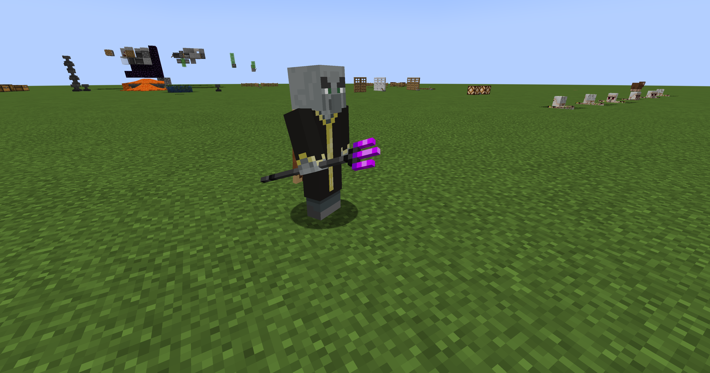
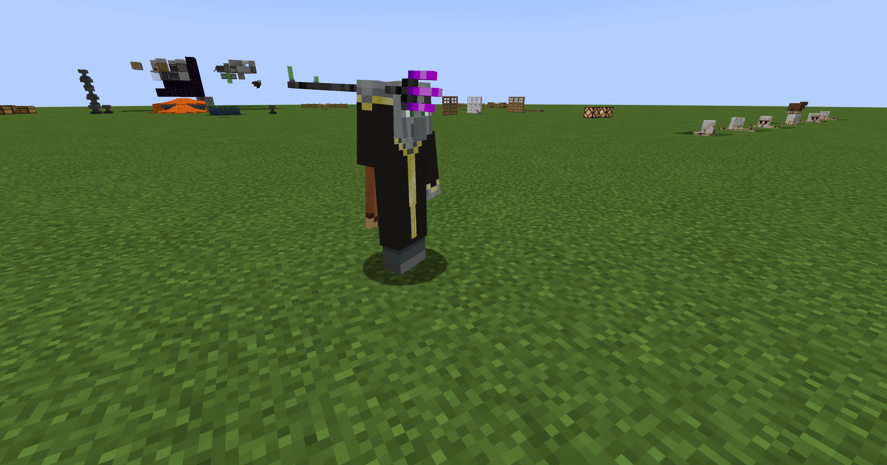
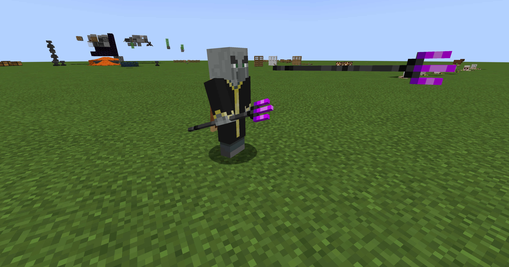

# DragonLoot

## Maintainer's Note

I am an ordinary Minecraft player and had never worked on a Java project before this repository.

This fork exists because several regressions apparent during basic gameplay remained unresolved. With no prior Java experience, I turned to GPT-5.6 to investigate them.

I originally reported the following three issues upstream; the fixes in this fork were produced with GPT-5.6:

- #1: Dragon Bow appears to have no damage bonus: https://github.com/nullifyac/dragonloot-forge-neoforge/issues/1
- #2: Dragon Trident consumes durability but is not thrown: https://github.com/nullifyac/dragonloot-forge-neoforge/issues/2
- #3: Dragon Trident renders as a flat 2D item while held: https://github.com/nullifyac/dragonloot-forge-neoforge/issues/3

DragonLoot adds dragon-themed equipment to Minecraft. This standalone project targets Minecraft 1.21.1 on NeoForge.

## Requirements

- Minecraft 1.21.1
- NeoForge 21.1.65 or newer
- Java 21

## Build

Run:

```bash
./gradlew build
```

The installable mod is written to `build/libs/dragonloot-1.1.10.jar`. Do not install the `-sources.jar`; it contains source code and is not a playable mod.

## Repaired Behavior

- Dragon Bow and Dragon Crossbow arrows use the same `base * 1.25 + 1` damage formula.
- Dragon Trident throws a custom projectile with vanilla-shaped trident behavior.
- A held Dragon Trident renders as a 3D model, while inventory-oriented contexts remain 2D.

## In-Game Verification

The Dragon Trident rendering and throwing fixes were verified in Minecraft 1.21.1 with NeoForge.

| Held | Charging | Thrown |
| :---: | :------: | :----: |
|  |  |  |

## Manual Verification

The fixes were verified in-game with `build/libs/dragonloot-1.1.10.jar`. The checks remain useful when validating future builds.

- Fire the same arrows from fully charged, unenchanted vanilla and Dragon bows at equivalent unarmored targets. Because critical damage is random, repeat the test or inspect target health and verify the Dragon arrow uses `base * 1.25 + 1` damage.
- Fire the same unenchanted arrows from vanilla and Dragon crossbows at equivalent unarmored targets and verify the Dragon arrow uses the same formula. Separately fire fireworks and verify they receive no arrow damage multiplier.
- In survival, throw an unenchanted Dragon Trident; verify one durability is consumed, the item leaves the hand and inventory, and a visible custom projectile damages its target.
- In creative, throw a Dragon Trident; verify the held trident remains and the projectile has the creative pickup restriction.
- Verify Loyalty returns the thrown Dragon Trident to its owner.
- During a thunderstorm under open sky, verify Channeling creates exactly one lightning bolt.
- Verify Riptide activates in water, rain, and lava, and fails on dry land outside lava.
- Verify inventory and ground displays remain 2D, while first-person and third-person held displays are 3D, including while charging.

## License

DragonLoot is licensed under GPLv3.
